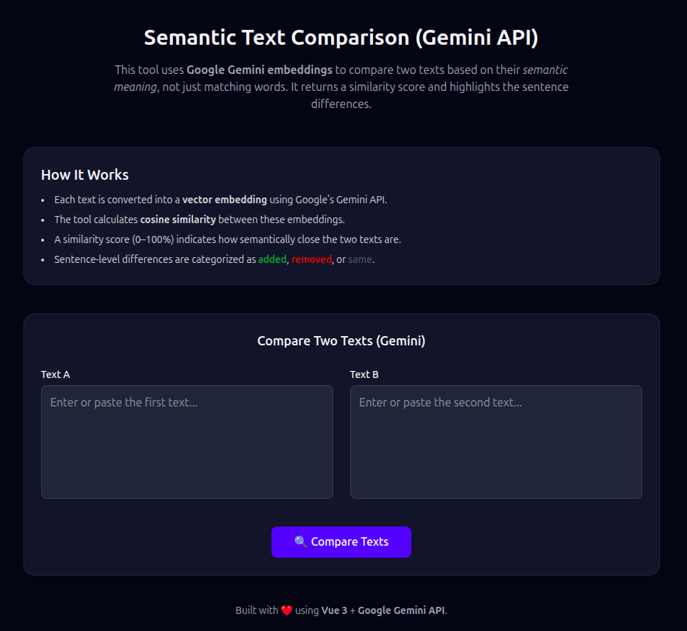

# 🧠 Vue Semantic Text Comparison Tool

A modern Vue 3 application that uses **Google Gemini AI** to perform semantic text comparison. Unlike traditional text comparison tools that only match exact words, this tool analyzes the **meaning** and **context** of texts to provide intelligent similarity scoring and detailed difference analysis.



---

## 🚀 Features

- 🤖 **AI-Powered Semantic Analysis** using Google Gemini embeddings
- 📊 **Similarity Scoring** with cosine similarity calculation (0-100%)
- 🔍 **Sentence-Level Comparison** with visual diff highlighting
- 🎨 **Modern Dark/Light Theme** with Tailwind CSS
- ⚡ **Real-time Processing** with Vue 3 Composition API
- 📱 **Responsive Design** that works on all devices
- 🎯 **Visual Progress Bar** showing similarity percentage
- 🔤 **Smart Text Parsing** with automatic sentence detection

---

## 🛠️ Tech Stack

- [Vue 3 + Composition API](https://vuejs.org/) - Modern reactive framework
- [Google Generative AI](https://ai.google.dev/) - Gemini embeddings for semantic analysis
- [Tailwind CSS v4](https://tailwindcss.com/) - Utility-first CSS framework
- [Vite](https://vitejs.dev/) - Fast build tool and dev server
- JavaScript ES6+ - Modern JavaScript features

---

## 🧪 How It Works

1. **Text Input**: Enter two texts you want to compare
2. **Embedding Generation**: Each text is converted to vector embeddings using Gemini AI
3. **Similarity Calculation**: Cosine similarity is computed between the embeddings
4. **Difference Analysis**: Sentences are categorized as:
   - 🟢 **Added** - Present in Text B but not in Text A
   - 🔴 **Removed** - Present in Text A but not in Text B  
   - ⚪ **Same** - Present in both texts
5. **Visual Results**: Score and differences are displayed with color coding

---

## 📦 Installation & Setup

### Prerequisites
- Node.js 16+ and npm
- Google Gemini API key ([Get one here](https://makersuite.google.com/app/apikey))

### Steps

```bash
# Clone the repository
git clone https://github.com/ArjunvDevaraj/vue-sematic-compare.git
cd vue-sematic-compare

# Install dependencies
npm install

# Set up environment variables
cp .env.example .env
# Edit .env and add your Gemini API key:
# VITE_GEMINI_API_KEY=your_api_key_here

# Start development server
npm run dev
```

### Build for Production

```bash
npm run build
npm run preview
```

---

## 🎯 Usage Examples

### Academic Text Comparison
Compare different versions of essays, research papers, or academic content to understand semantic changes.

### Content Analysis
Analyze how similar two articles, blog posts, or marketing copy are in meaning, not just words.

### Translation Quality
Compare original text with translations to measure semantic preservation.

### Documentation Updates
Check how much the meaning of documentation has changed between versions.

---

## 📁 Project Structure

```
vue-sematic-compare/
├── public/
│   ├── favicon.png
│   └── preview-sematic.png     # App screenshot
├── src/
│   ├── components/
│   │   └── CompareText.vue     # Main comparison component
│   ├── App.vue                 # Root component
│   ├── main.js                 # App entry point
│   └── style.css               # Global styles
├── .env.example                # Environment template
├── package.json
├── vite.config.js              # Vite configuration
└── README.md
```

---

## ⚙️ Configuration

### Environment Variables

| Variable | Description | Required |
|----------|-------------|----------|
| `VITE_GEMINI_API_KEY` | Your Google Gemini API key | ✅ Yes |

### API Limits
- Google Gemini API has rate limits and quotas
- Consider implementing request throttling for production use
- Monitor your API usage in the Google Cloud Console

---

## 🔧 Development

### Available Scripts

```bash
npm run dev      # Start development server
npm run build    # Build for production
npm run preview  # Preview production build
```

### Key Components

- **`CompareText.vue`** - Main component handling text input, API calls, and results display
- **`App.vue`** - Root component with layout and project information
- **Gemini Integration** - Uses `text-embedding-004` model for generating embeddings

---

## 🚀 Deployment

This app can be deployed to any static hosting service:

- **Netlify**: Connect your GitHub repo for automatic deployments
- **Vercel**: Import project and set environment variables
- **GitHub Pages**: Use GitHub Actions for automated builds
- **Firebase Hosting**: Deploy with Firebase CLI

Remember to set your `VITE_GEMINI_API_KEY` environment variable in your hosting platform.

---

## 🤝 Contributing

1. Fork the repository
2. Create a feature branch (`git checkout -b feature/amazing-feature`)
3. Commit your changes (`git commit -m 'Add amazing feature'`)
4. Push to the branch (`git push origin feature/amazing-feature`)
5. Open a Pull Request

---

## 📝 License

MIT License © 2025 Arjun V D

---

## 👤 Author

**Arjun V Devaraj**
- 🐙 **GitHub**: [@ArjunvDevaraj](https://github.com/ArjunvDevaraj)
- 💼 **LinkedIn**: [arjunvdevaraj](https://www.linkedin.com/in/arjunvdevaraj)
- 📧 **Email**: [Contact via GitHub](https://github.com/ArjunvDevaraj)

---

## ⭐ Show Your Support

If this project helped you, please consider giving it a ⭐ on GitHub!